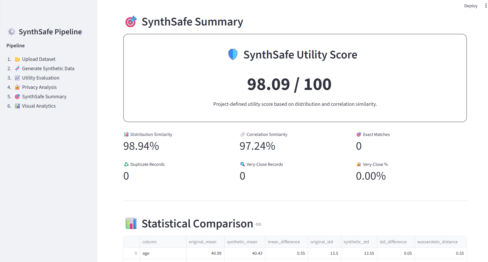

# 🛡️ SynthSafe

### Synthetic Data Generator + Privacy Analyzer

SynthSafe is a Python-based data engineering and privacy analysis project that generates synthetic tabular data and evaluates how closely the synthetic dataset preserves the statistical characteristics of the original data while providing privacy-related proximity indicators.

---

## 🚀 Overview

Synthetic data can be useful for development, testing, analytics, and machine learning when directly sharing real-world data is undesirable.

SynthSafe provides an end-to-end pipeline to:

- Analyze an input dataset
- Generate synthetic records
- Compare original and synthetic distributions
- Compare relationships between numerical features
- Detect exact duplicate records
- Analyze synthetic-to-original record proximity
- Produce a combined utility score
- Present the results through an interactive Streamlit dashboard

---

## ✨ Features

### 📂 Dataset Profiling

Analyzes the uploaded dataset and reports:

- Number of records
- Number of features
- Data types
- Missing values
- Basic statistical characteristics

### 🧬 Synthetic Data Generation

Generates a synthetic dataset while attempting to preserve important statistical relationships present in the original data.

### 📈 Utility Evaluation

Compares original and synthetic datasets using:

- Distribution similarity
- Statistical differences
- Correlation differences

### 🔐 Privacy Analysis

Provides privacy-related indicators including:

- Exact synthetic/original matches
- Duplicate synthetic records
- Synthetic-to-original nearest-neighbor distances
- Minimum distance
- Average distance
- Median distance
- Very-close record count
- Very-close record percentage

> **Note:** These are proximity-based privacy indicators and are not formal differential privacy guarantees.

### 🎯 SynthSafe Score

SynthSafe calculates a project-defined utility score using:

- Distribution similarity
- Correlation similarity

The score is intended as a project evaluation metric rather than an industry-standard privacy score.

### 📊 Interactive Dashboard

The Streamlit dashboard provides:

- Dataset previews
- Synthetic dataset previews
- Evaluation metrics
- Statistical comparison tables
- Correlation comparison
- Original vs synthetic visualizations
- Privacy analysis
- Downloadable reports

---

## 🏗️ System Architecture

```text
                ┌─────────────────┐
                │   Input CSV     │
                └────────┬────────┘
                         │
                         ▼
                ┌─────────────────┐
                │ Dataset Profiler│
                └────────┬────────┘
                         │
                         ▼
              ┌──────────────────────┐
              │ Synthetic Generator  │
              └──────────┬───────────┘
                         │
                         ▼
                ┌─────────────────┐
                │ Synthetic Data  │
                └────────┬────────┘
                         │
              ┌──────────┴──────────┐
              ▼                     ▼
      ┌───────────────┐     ┌────────────────┐
      │Utility         │     │Privacy         │
      │Evaluation      │     │Analysis        │
      └───────┬───────┘     └───────┬────────┘
              │                     │
              └──────────┬──────────┘
                         ▼
                ┌─────────────────┐
                │ SynthSafe Score │
                └────────┬────────┘
                         │
                         ▼
                ┌─────────────────┐
                │Streamlit         │
                │Dashboard         │
                └─────────────────┘## 📸 Dashboard

